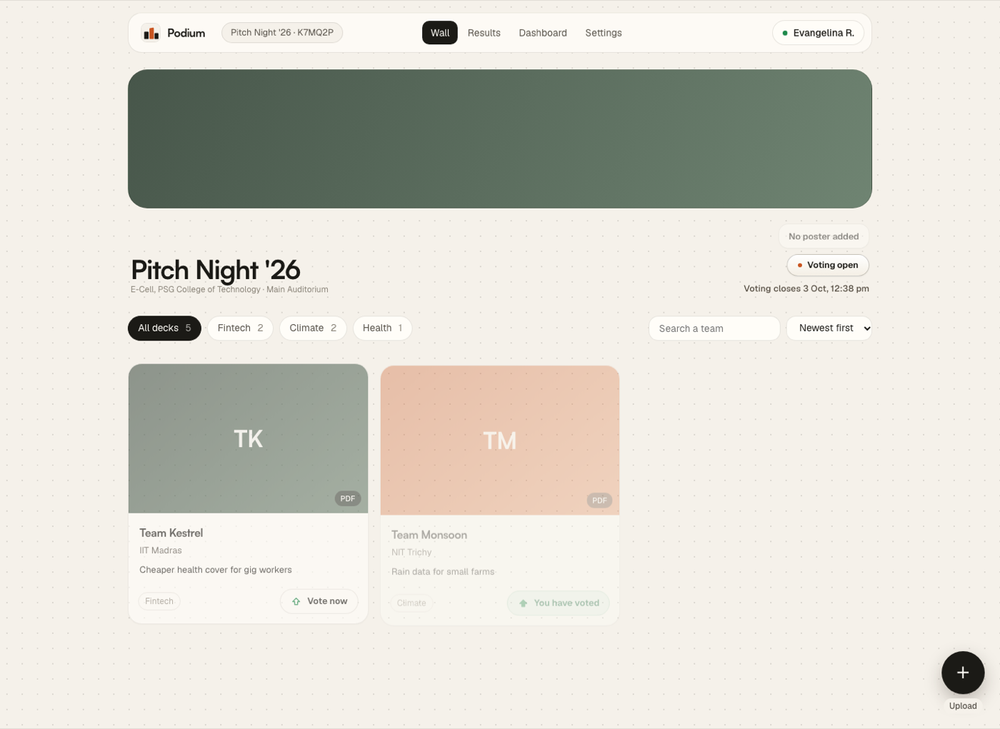
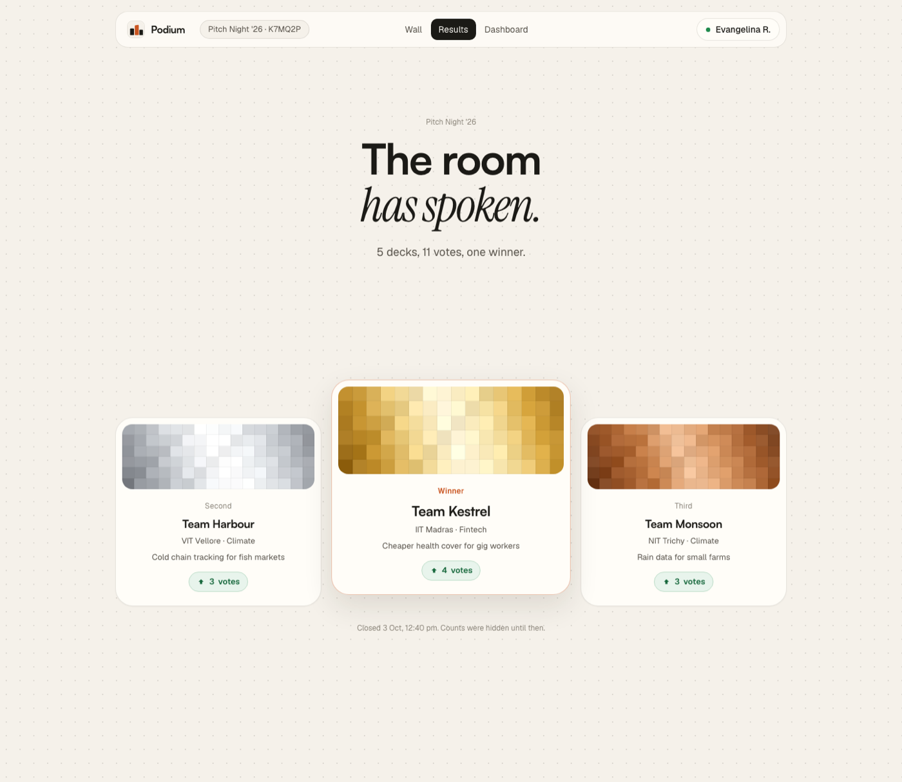
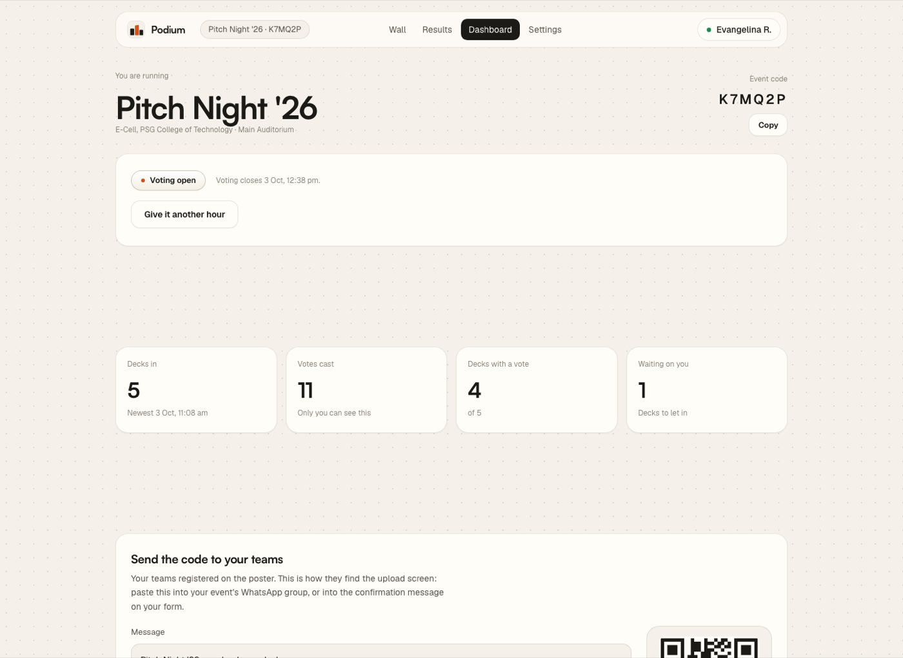
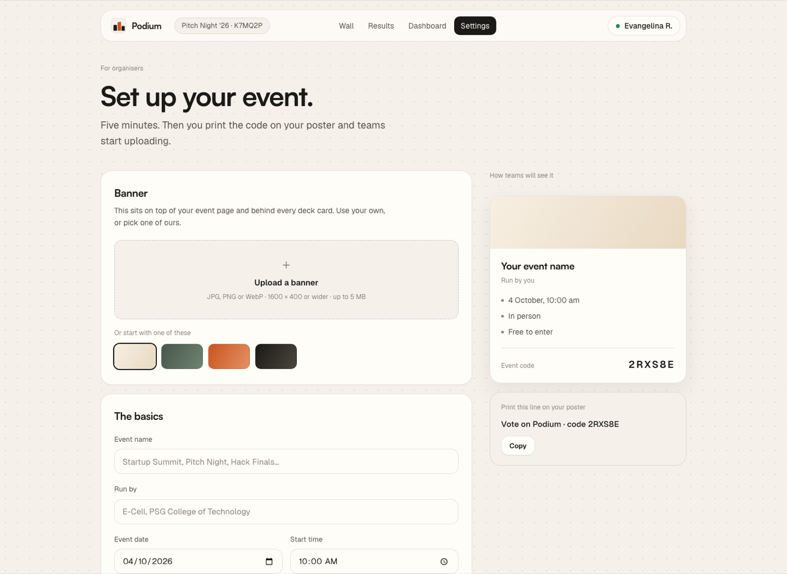
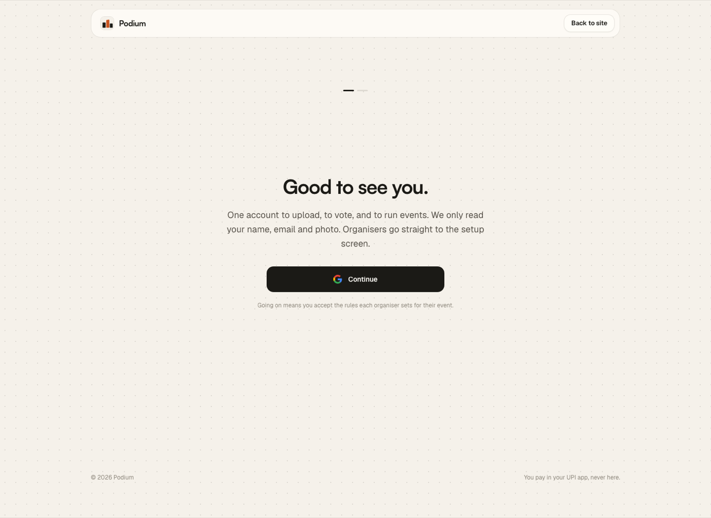
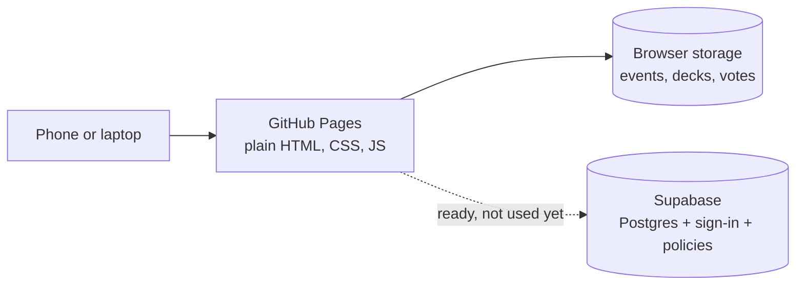
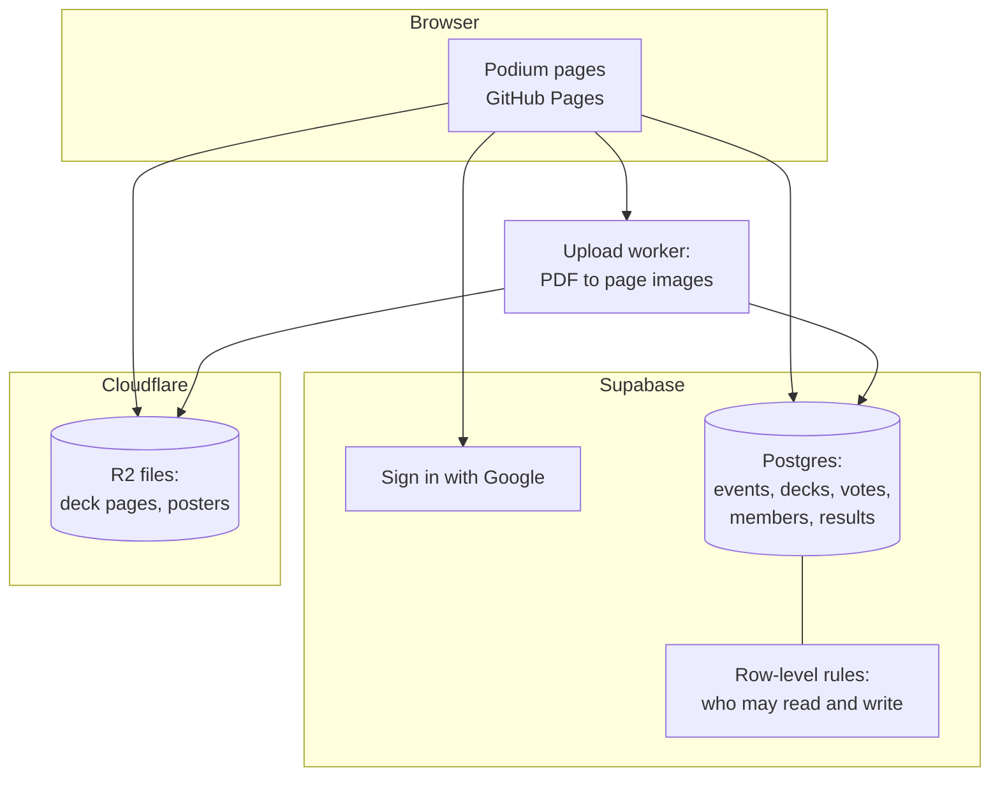

# Podium — show your slides, win the room

A small website for pitch competitions, hackathons and case contests. Teams put
their deck here, the whole room reads it on their phones, the room votes, and
the winners go up on a podium page that stays online.

**Live:** https://rmagdaleena2508-01.github.io/OLTA---VOTE-YOUR-PPT/
**Version:** v1 — the whole flow runs in the browser. See [What's in v1](#whats-in-v1).
**Backend:** Supabase project `podium` (Mumbai, free plan), schema and policies applied.


---

## 1. The problem I am solving

Most college competitions are won or lost on a slide deck. The contest itself is
fine. Everything around it is a mess.

Here is how a normal event goes today:

1. Teams send their deck on WhatsApp or by email.
2. Some files never arrive. Someone opens `final_v2_FINAL.pptx` and judges the
   wrong one.
3. Only three judges ever see the decks. The 200 people sitting in the hall see
   nothing.
4. Voting happens on paper slips, by clapping, or by raised hands.
5. Nobody believes the count. There is always one team that thinks it was fixed.
6. A week later nothing is left. No decks, no scores, no winners page.

So the work is not the contest. The work is the hour around it.

## 2. My main idea

**Put every deck in one place, and let the whole room vote on it.**

That is the whole product. Not a competition platform, not an event manager —
the missing middle:

- One link where every deck lives.
- One honest way to vote, with rules the website cannot bend.
- One results page that stays up afterwards.

Three rules hold it together:

1. You can back as many decks as you like, but only **once each**.
2. A vote is **final**. No taking it back, so nobody can be talked into
   switching in the last ten minutes.
3. **No counts are shown** to anyone until the organiser closes voting. Only the
   organiser sees numbers while it runs.

## 3. How I got to this idea

I was looking at how these events actually run, not at how software usually
describes them.

- The poster already does a lot. It carries the rules, the Google Form and the
  payment QR code. Teams sign up there and pay there. That part works, so I do
  not touch it.
- The judges are not the problem either. The problem is that **the audience has
  nothing to do**. Two hundred people sit and watch three people decide.
- Everyone in that room already has a phone, and the deck is already a PDF.

So the gap is narrow and clear: between "the team registered on the poster" and
"somebody announces a winner", there is nothing. Podium is only that gap. It
starts when a team arrives with an event code, and it ends when the podium page
is live.

I also went and read how the big ones handle voting — Product Hunt, Devpost,
Devfolio, DoraHacks, Unstop — and took their rules rather than their looks.
Those sources are in [`docs/MARKET-RESEARCH.md`](docs/MARKET-RESEARCH.md).

## 4. What I have built so far

Six screens, working end to end in the browser.

### The deck wall

Every deck as a card: the team's initials on a coloured cover, the team name,
college, one line about the idea, its group, and one vote button. Filter chips
per group, a search box, and a sort. The round upload button sits bottom right.



### The results page

When voting closes, the page becomes a podium: the winner in the middle and
raised, second on the left, third on the right, with gold, silver and bronze
banners. Below it, every other deck in order, and a CSV for the organiser.



### The organiser's dashboard

Not a wall of charts — a short list of jobs. What stage the event is in, the
buttons that make sense right now, four counts, the decks to let in or hide, the
standings, and the message to paste into the team WhatsApp group with a QR code
of the wall.



### Setting up an event

Banner, name, date, where, the link to the organiser's own sign-up form, deck
rules, the voting window, and whether the event is listed or code-only. A live
preview of the card teams will see sits beside it, with the six-character code.



### Signing in

Two steps. Sign in, then say whether you came to submit a deck or to browse and
vote, and add your name and college. Organisers skip the question and go
straight to setting up their event.



> The screenshots use made-up teams so the screens are not empty. The live site
> shows nothing until a real organiser sets up a real event.

## 5. How it is put together, and what comes next

### Today



Everything runs in the browser. No build step, no server. The Supabase project
is created and the rules are loaded into it, but no screen reads from it yet, so
the site keeps working while it is being wired up one screen at a time.

### Where it is going



**Why this shape.** The two rules that matter cannot live in a browser. "One
vote per deck" is a unique line in the database:
`unique (event_id, voter_id, deck_id)` — a second vote cannot be saved, whatever
the browser sends. "No counts before the close" is a read rule the database
applies to everyone except the organiser. A rule the console can edit is not a
rule.

**What each part does**

| Part | Job | Why this one |
|---|---|---|
| GitHub Pages | Serves the pages | Free, HTTPS, no build step. A push is a deploy |
| Supabase | Database, sign-in, rules | The only free tier with Postgres, sign-in and row-level security in one place |
| Cloudflare R2 | Deck files and images | 10 GB and no charge for traffic out, which matters when 300 phones open decks at once |
| A small worker | Turns a PDF into page images | The wall shows pictures, so nobody can download the original |

**The order of work from here**

1. Sign in with Google, and a profile row for each person.
2. Move the deck wall onto the database: real decks, real votes, real counts.
3. Turn uploaded PDFs into page images, and store the real page count.
4. Move files to R2, with originals deleted after 90 days by a bucket rule.
5. Teams and Voters lists for the organiser, with CSV.
6. An event page with the poster, the dates and a countdown.
7. A share card for winners, sized for Instagram stories.

The full plan, including the security holes to close first, is in
[`docs/BUILD-PLAN.md`](docs/BUILD-PLAN.md).

### Run it on your machine

```bash
python3 -m http.server 8793 --directory deck-comp
```

Then open http://localhost:8793.

### Where things live

| What | File |
| --- | --- |
| Landing page | `index.html` |
| Sign in | `onboarding.html` |
| Set up an event | `create-event.html` |
| The deck wall | `event.html` |
| Organiser dashboard | `dashboard.html` |
| Results and podium | `results.html` |
| Every component and token | `styles.css` |
| All behaviour | `app.js` |
| Database calls | `supabase-client.js` |
| Keys the browser may hold | `config.js` |
| Tables and rules | `supabase/*.sql` |
| Research and plans | `docs/` |

---

## How the voting works

The rules come from looking at how Product Hunt, Devpost, Devfolio and DoraHacks
handle the same problem. Sources are in [`docs/MARKET-RESEARCH.md`](docs/MARKET-RESEARCH.md).

- **You must sign in to vote.** No product in this space lets strangers decide a
  prize. One Google account is one voter.
- **Back as many decks as you like, once each.** This is Product Hunt's and
  Devpost's rule. A good idea should not cost you the chance to back another one.
- **A vote is final.** Once you back a deck, that deck is closed to you and the
  button reads "You have voted". Taking votes back turns the last hour of an
  event into lobbying — teams walk the hall asking people to switch.
- **You cannot vote for your own team.**
- **Counts stay hidden until voting closes.** This is Devpost's own advice. When
  people can see a leader, the leader snowballs and everyone else gives up.
- **No weighted or "spend 10 points" voting.** That idea is real — it is called
  quadratic voting, and Devfolio and DoraHacks both use it. It is wrong here: it
  breaks the moment someone makes fake accounts, and every platform that uses it
  has to ship a page explaining it. If a voting system needs a manual, it will
  lose a hall full of students.

## How a code reaches a team

Teams register on the organiser's own poster, which circulated on WhatsApp long
before the Podium event existed. So the code cannot live on that poster. The
dashboard hands the organiser a message to paste into the event's WhatsApp
group — event name, wall link, code, file rules and the voting deadline — plus a
QR of the wall they can attach. The poster itself is kept only so a team can tap
it on the wall and re-read the rules.

## How event codes work

The organiser prints a six-character code on the poster. Someone types it on the
home page and lands in that event.

The code alphabet is `ABCDEFGHJKLMNPQRSTUVWXYZ23456789` — no `O`, `I`, `0` or `1`,
because those four are what people misread off a poster from across a hall. That
gives about 1.07 billion combinations, so guessing a live code is pointless.

Codes are a shortcut, not a gate. An event link works too, and public events show up
in a browsable list. Only private events truly need the code.

Full design, including the lookup endpoint and the database tables:
[`docs/EVENT-CODES.md`](docs/EVENT-CODES.md).

---

## File rules for uploads

- PDF or PPTX. PDF is safer — fonts and layout stay exactly as the team made them.
- 25 MB per file. Unstop's own rounds cap at 20 MB and Devpost at 35 MB, so this
  sits between two real-world limits.
- 15 slides by default, which an organiser can change.
- Decks stay public for 30 days after the event, then only the team and the
  organiser can see them. The original files are deleted at 90 days. Winning decks
  stay on the results page for good.

## What's in v1

Version 1 is everything below. It is the whole flow, front to back, running in
the browser — the screens are real, the rules are real, and the data lives in
the browser until a server is added.

**The pages**

| Page | What it does |
|---|---|
| `index.html` | The landing page: hero, live counter bar, the "Trusted by" college row, how an event runs, the three roles in tabs, a sample podium, and the questions people ask |
| `onboarding.html` | Sign in, say what you came for, add your name and college. Two steps |
| `create-event.html` | The organiser's setup screen: banner, name, date, mode, sign-up link, deck rules, voting window, who can find it — with a live preview of the event card and the code to share |
| `event.html` | The deck wall: every deck as a card, filters per group, search, sort, the round Upload button, a slide viewer, and the vote button |
| `dashboard.html` | The organiser's screen: the share kit, four counts, decks to let in or hide, standings, the checks worth running, and the button that closes voting |
| `results.html` | The podium, the rest of the field, copy the results, download the CSV |

**The rules that work today**

- One vote per deck. Back as many decks as you like, once each, and a vote can
  never be taken back — the button turns into "You have voted" and closes.
- Nobody can vote for their own deck.
- No vote count is shown to anyone until the organiser closes voting. The
  organiser sees counts on their dashboard the whole time.
- Voting only opens inside the window the organiser set, and the organiser can
  open it, extend it, or close it by hand.
- Uploads are PDF or PPTX, up to 25 MB, one deck per team, with a slide limit the
  organiser chooses.
- Event codes are six characters with no `O`, `I`, `0` or `1`, so a code read off
  a poster cannot be mistyped into a different event.
- Sign-ups and money never touch the site. They stay on the organiser's own form.

**How it looks and moves**

- Warm off-white page with a faint dot grid, Satoshi for headings, Geist for
  everything else, one line of Instrument Serif italic in the hero, and one
  accent colour reserved for the vote.
- The hero photograph sits behind the words, and the section below laps over it as
  a rounded sheet, so there is no hard seam.
- A glass card across that seam counts three numbers up from zero.
- The vote arrow flies up and away when pressed, and the winners' podium rises
  step by step with one burst of confetti behind the winner.
- Three college marks drift left to right under "Trusted by" at a steady walking
  pace.

**What is still a placeholder in v1**

- Sign-in does not sign anyone in yet: finishing the profile screen is what
  counts as being signed in, and roles live in the browser.
- The counter bar shows 1 event, 3 decks and 6 votes as illustration.
- The sample podium on the landing page uses made-up team names.
- Slides are not rendered yet, so the viewer shows a frame per slide rather than
  the slide itself.
- Decks and votes are kept in the browser, so counts are per device.

**Next, and why it needs a server**

1. **Real accounts** — one sign-in, and a role that comes from what you did, not
   from what the browser claims.
2. **Real decks and votes** — a database with a unique constraint on
   `(event_id, voter_id, deck_id)`, so a double vote is impossible in the data
   and not only in the interface.
3. **Slide rendering** — turn a PDF into page images on upload, and read the real
   page count while doing it.
4. **Teams and Voters lists** for the organiser, with CSV.
5. **Event page** — poster, dates, a link out to the sign-up form, and a countdown.
6. **Share card** — a 1080 x 1920 image of the winner for the stories teams post
   anyway.

The plan for all six, with the security holes to close first, is in
[`docs/BUILD-PLAN.md`](docs/BUILD-PLAN.md).

> Keeping this file honest: new work goes under **What's in v2** when I say so.
> Until then, changes belong in this v1 section.

## The problems faced while building it

Building fast leaves a gap between what the screen promises and what the code
does. A read-through of every page found ten places where a button, a link or a
line of text said one thing and did another. Grouped, they were six problems.

**1. The product's own rule went stale in the copy.**
The voting rule changed twice while building — from one vote per category, to
credits, to unlimited votes cast once each and never taken back. The code
followed each change. The FAQ did not, so the page still told readers "you get
one vote in each group". The most-read explanation on the site described a
product that no longer existed.

**2. A promise was made that nothing could keep.**
"Sign in with Google" appeared in four places. There is no sign-in yet, so the
button named a provider it had never spoken to. A visitor who trusts that line
and finds nothing happens stops trusting the rest of the page too.

**3. An input that accepted everything.**
The hero asked for a six-character event code, checked that it *looked* like a
code, and then threw it away — every value opened the same event. A field that
never says no is worse than no field, because it teaches people the code does
not matter.

**4. Links written before the pages they point at.**
The landing page's logo pointed at `/`, which is the domain root and a 404 on
GitHub Pages. An "Open your organiser invite" line was an empty anchor whose
click handler quietly made anyone an organiser. A menu item called "Voting"
scrolled to a section about roles. Two footer links shared one destination. A
footer mailbox belonged to a domain that does not exist.

**5. Controls that vanished instead of explaining.**
"See the poster" hid itself when no poster had been uploaded, which reads as a
missing feature rather than a missing file.

**6. A number invented to fill a gap.**
The deck viewer showed "Slide 3 of 15". The 15 was the event's *slide limit*,
borrowed because the real page count was not known. A made-up total is worse
than no total: it is a fact the reader cannot check and will quote back.

## How we tackled these six problems

**1. One rule, written once.**
The FAQ answer was rewritten to the rule the code enforces: back as many decks
as you like, once each, a vote cannot be taken back, and no one votes for their
own team. Every other page that mentions voting was checked against the same
sentence.

**2. Say only what works today.**
Every "with Google" is gone. The header says **Sign in**, the onboarding button
says **Continue**, and the provider stays unnamed until it actually signs
someone in. Naming it is a one-line change on the day it works.

**3. Make the input answer back.**
The code is now matched against the event it claims to open. A wrong code is
refused by name — "No event with the code ZZZZZZ." A badly shaped code gets its
own message. When no event exists at all, the field says so and offers to set
one up. A correct code goes straight to the wall instead of detouring through a
sign-in that does not exist.

**4. Every link points at something real.**
The logo goes to `index.html`, like the other five pages. The invite line reads
**Set up an event** and links to the setup screen — no pretend invite, and no
handler granting rights on a click. The menu item became **Who does what**,
matching the section underneath it. The two footer links got their own anchors,
`#faq-deck` and `#faq-enter`. The dead mailbox became **Report a problem**,
pointing at the repository's issues, which exists and is read.

**5. Disable, don't disappear.**
"See the poster" stays on screen, disabled, reading **No poster added**, with a
tooltip saying the organiser has not uploaded one. The reader learns the state
of the event instead of guessing about the software.

**6. Show a number only when it is known.**
New uploads store no page count at all. The viewer says **Page 3** with no
total, the Next arrow stops guessing where the end is, and the card's corner
pill reads **PDF** instead of a slide count. When pages are really rendered, the
count appears everywhere on its own.

**The rule this left behind:** if the interface cannot keep a promise today, it
should not make it. An honest empty state costs nothing; a confident lie costs
the reader's trust in everything next to it.

## The open doors, and how they were shut

After the lying buttons came the quieter problem: the screen asked politely and
the code did not insist. Six of those, in the order they mattered.

**1. A team name could run code in everyone's browser.**
Deck cards were built by dropping the team name, college and pitch line straight
into HTML. A team calling itself `` would have run script
in every viewer's browser, the organiser's included — and the organiser is the
one person holding the results.

Every value a person types now passes through one `esc()` function before it
reaches the page: the wall cards, the dashboard rows, the standings, the podium
and the results list. Tested with exactly that team name — it renders as plain
text, creates no element, and runs nothing.

**2. Anybody could vote, including for their own deck.**
The wall let a visitor with no account vote, and because "is this mine?"
compared the deck's owner to a name that did not exist, even your own deck was
votable.

Reading the wall still needs nothing. Voting needs an account: the button reads
**Sign in to vote** and goes to sign-in, rather than looking normal and doing
nothing. Uploading is the same, and the round upload button now says **Sign in**,
**Closed**, **No event** or **Uploaded** to match the state it is actually in.

**3. Identity was a display name.**
Ownership and self-vote checks compared what people had typed. Two teams called
"Team Kestrel" were the same person as far as the code knew.

A profile now carries a generated id, decks store `ownerId`, and every ownership
or self-vote check compares ids. Names are used only for decks uploaded before
ids existed. Votes are stored per voter id rather than in one shared list —
which is also the shape of the database table they are going into.

**4. The interface was the only rule-keeper.**
Every vote rule lived in the label. Opening the console and re-enabling a
disabled button was enough to break them.

`castVote` now re-checks the event stage, the deck's status, ownership and any
earlier vote immediately before it writes. Forcing the button open and clicking
it changes nothing. Upload does the same: one deck per account per event, nothing
after the organiser's deadline, and a group has to be one the organiser actually
created rather than whatever the dropdown was edited to say.

**5. Typed text was taken as typed.**
Names went in with whatever they contained — invisible control characters, runs
of spaces, any length at all. That is how a tidy list gets vandalised.

Text is cleaned on the way in: control characters stripped, whitespace
collapsed, trimmed, and capped — 60 characters for a team, 80 for a college, 90
for the pitch line, 24 for a group name, eight groups at most. Slide limits are
clamped to between 3 and 60, and voting can no longer be set to open before
uploads close.

**6. Two silent failures.**
A `javascript:` address typed into the meeting or sign-up link field would have
become a live link on the event page. And a large poster can fill the browser's
5 MB of storage, after which every save failed without a word — the deck looked
uploaded and was not.

Links are accepted on `http` and `https` only, and anything else is dropped.
Storage reads can no longer throw on hand-edited data, and a failed write is
reported: the deck is rolled back and the screen says the browser is out of
storage.

**What is still open, and why only a server can close it.** Roles are still a
value in the browser, so the console can still claim to be an organiser, and
votes still live on the device. Both need the database: a role is a membership
row, and a vote is a row with `unique (event_id, voter_id, deck_id)` — which is
what makes a second vote impossible rather than merely difficult. The plan is in
[`docs/BUILD-PLAN.md`](docs/BUILD-PLAN.md) and the full audit, with what is fixed
and what is not, is in [`docs/AUDIT-V1.md`](docs/AUDIT-V1.md).

## The backend: Supabase and Cloudflare R2

v1 keeps everything in the browser. v2 moves it to a database, because two of
this product's rules cannot live in a browser at all: "one vote per deck" and
"no counts until voting closes". A rule the console can edit is not a rule.

**What was chosen, and why.**

- **Supabase** for data, sign-in and permissions. It is the only free tier that
  carries Postgres, sign-in and row-level security in one project, and those
  three are exactly where the voting rules belong. 500 MB of rows is far more
  than a fest needs: an event is one row, a deck one row, a vote one row, so a
  300-voter event is a few thousand rows.
- **Cloudflare R2** for files. 10 GB, and no charge for traffic out — which
  matters when 300 people open decks on the venue wifi at the same time. A 25 MB
  deck cap means Supabase's own 1 GB of storage would fill after about 40 decks;
  R2 holds a term's worth.
- Both are managed. Nothing to patch, back up or restart.
- **Firebase was rejected.** Its Cloud Storage left the free plan in February
  2026, so uploads would need a card from the first deck, and Firestore has no
  unique constraints — the one thing this product is built on.

**The catch, and the fix.** A free Supabase project is paused after seven days
without database activity, and a fest runs once a term. Data survives a pause —
it restores from the dashboard with the disk intact — but anyone opening the site
mid-pause sees errors. So a scheduled GitHub Action reads one row every third
day, which counts as activity and keeps the project awake. It is ten lines of
YAML and costs nothing.

**The project is live.** `podium`, in the R.MAGDALEENA organisation, Mumbai
region, free plan, at `https://hfetqtgvscyrmiesdswk.supabase.co`. The schema and
the policies are applied, and `config.js` points the site at it. Nothing uses it
yet — every screen still reads browser storage — so the site works exactly as
before while the screens are moved across one at a time.

**What the security check found, and why it mattered.** Supabase runs advisors
over a project. After the first two migrations it flagged three things, and all
three were real:

1. The view that counts votes ran with its creator's rights, so it read vote
   rows straight past the policies. A visitor could have asked it for counts
   before voting closed. It now runs as whoever is asking.
2. The helper functions the policies use sat in the `public` schema, which is
   published as an API, so anyone could call them directly. They moved to a
   private schema.
3. The trigger that refuses to change a vote had no fixed search path — the
   usual way a privileged function gets tricked into running the wrong code.

Advisors are clean now, and all eight tables have row-level security on. Checked
from the browser with no account: reading votes returns nothing, and inserting a
vote, an event or a profile is refused with *"new row violates row-level
security policy"*.

**What is in the repository now**

| File | What it does |
|---|---|
| `supabase/01-schema.sql` | Tables, types, constraints, indexes, the vote-count view, and a trigger that refuses to change or delete a vote |
| `supabase/02-policies.sql` | Row-level security for every table — who may read and write what |
| `supabase/03-keepalive.sql` | The single `heartbeat` row the scheduled job reads |
| `.github/workflows/keep-supabase-awake.yml` | Reads that row every third day so the project never pauses |
| `config.example.js` | Copy to `config.js` and fill in the keys. `config.js` is git-ignored |
| `supabase-client.js` | One module for sign-in, events, decks, votes, counts and results. Returns `{ data, error }` and never throws; if the config is missing it does nothing and the screens fall back to browser storage |
| `config.js` | The project URL and the publishable key |
| `docs/SUPABASE-SETUP.md` | What still needs your own login: Google sign-in and the R2 bucket |

**The six rules the database will enforce, not the interface**

1. `unique (event_id, voter_id, deck_id)` — a second vote for the same deck
   cannot be inserted, whatever the browser sends.
2. A vote inserts only if you are signed in, the event is in its voting stage,
   the deck is live, you are a member of the event, and **you do not own that
   deck**.
3. Vote rows are readable by the organiser at any time, and by everyone only
   once the stage is `closed`. Before that, a curious visitor querying directly
   gets nothing.
4. There is no update or delete policy on votes, and a trigger refuses both, so
   "a vote is final" is true at the storage layer.
5. `unique (event_id, owner_id)` on decks — one deck per team per event.
6. Your role comes from a membership row, so the console can no longer claim to
   be an organiser.

**Keys, in one line.** The **anon** key is meant to be public and sits in the
browser; the policies are what protect the data. The **service_role** key
bypasses every policy and never goes into this repository, a workflow, or the
browser.

## Hosting: GitHub Pages

The site is live at
**https://rmagdaleena2508-01.github.io/OLTA---VOTE-YOUR-PPT/**

It is served by GitHub Pages straight from the `main` branch, root folder. There
is no build step, so a push is a deploy: commit, push, and the new version is up
in under a minute.

**Why Pages suits this product.** The whole front end is plain HTML, CSS and
JavaScript, so there is nothing to compile and nothing to run on a server. Pages
gives free hosting, HTTPS and a CDN, and the database lives somewhere else, so
the only thing being served is files. A college fest sending 300 phones at it at
once is well inside what a static host handles without thinking.

**How it is set up**

| Setting | Value |
|---|---|
| Source | Deploy from a branch |
| Branch | `main`, folder `/` (root) |
| HTTPS | Enforced |
| Custom domain | None yet |

Every page is at the top level, so the URLs are plain:

```
/                     the landing page
/onboarding.html      sign in
/create-event.html    set up an event
/event.html           the deck wall
/dashboard.html       run the event
/results.html         the podium
```

**Two things a static host changes**

1. **Links must be relative.** `href="/"` means the top of the domain, which on
   Pages is someone else's page, not this one. Every link points at
   `index.html` and friends instead. This was a real bug on the landing page
   once; it is fixed and worth remembering.
2. **Files are cached hard.** The stylesheet and script are requested with a
   version on the end — `styles.css?v=20260920235659` — which is bumped on
   every change. Without it a returning visitor keeps yesterday's script.

**Keys on a public host.** `config.js` sits in the open and holds the Supabase
project URL and its **publishable** key. That key is designed to be public;
what it can actually do is decided by the row-level policies in
[`supabase/02-policies.sql`](supabase/02-policies.sql). The **service_role** key
would ignore all of them and is not in this repository, in any workflow, or in
the browser.

**Deploying**

```bash
git add -A
git commit -m "what changed"
git push
```

Then check https://rmagdaleena2508-01.github.io/OLTA---VOTE-YOUR-PPT/ — hard
reload once with Cmd-Shift-R if you are looking for a change you just made.

To see it locally before pushing:

```bash
python3 -m http.server 8793 --directory deck-comp
```

## Design principles

I studied [notchowl.com](https://www.notchowl.com), [Luma](https://lu.ma) and
[Clerk](https://clerk.com) and pulled out the rules that make them feel expensive.
The long version is in [`docs/DESIGN-NOTES.md`](docs/DESIGN-NOTES.md). The short
version:

1. **One idea per screen.** One headline, two lines of text, one thing to click.
2. **Space is the luxury.** Sections breathe at 96–144px. Empty room reads as
   confidence; a packed page reads as cheap.
3. **Hierarchy comes from size and weight, never decoration.** Five type sizes do
   the whole site.
4. **Tighten big type.** Every heading over 36px is tracked in by about -0.03em.
   This one detail is most of the "premium" feeling. Untracked big type looks like
   a default template.
5. **Lines, not shadows.** Cards are a 1px hairline over a flat surface. Shadows
   only appear where something really floats, like the menu.
6. **One accent colour, one job.** Orange means "vote". It never means "new" or
   "warning", because then it would mean nothing.
7. **Plain words.** Short sentences, everyday verbs, real numbers instead of
   adjectives. "25 MB" beats "generous file limits".
8. **Name the action, not the object.** The organiser's list says "Teams to let in",
   not "Registrations".

## Where the look comes from

| Source | What I took |
|---|---|
| **notchowl.com** | The whole type and spacing system: near-single font family, tight tracking, hairline cards, no shadows, huge section padding, and the two-beat headline shape ("Less switching. More doing."). |
| **Luma** | How to ask someone who they are. Luma never shows a role form; it splits at the button — "Create Your First Event" or "Discover Events". Podium does the same with "Upload a deck" and "Browse and vote". |
| **Clerk** | Proof that a light theme can look sharp: off-white page, near-black text, 64px headline at -1.6px tracking. |
| **A hero reference shot** | Full-bleed photo, small pill above the headline, one line in a serif italic, and a single capsule holding an input and its button. |
| **Product Hunt, Devpost, Devfolio, Unstop** | The voting and file rules, not the visuals. |

---

## Design decisions, and what I chose against

**Light theme, not dark.**
The first build was near-black. It looked good and said nothing about a college fest.
A warm off-white (`#f6f6f4`) with a faint dot grid feels like paper, which is what
this product is really about. Pure white was too harsh; the warm grey holds the
photo better.

**Satoshi for headings, Geist for everything else.**
Geist alone was correct but cold — it is a developer-tool typeface, and the hero
photograph is warm. Satoshi has rounder, friendlier shapes and still holds tight
tracking at 68px. Geist stays for body and interface text, where it is better at
13–18px. One line of the headline is Instrument Serif italic — one moment of
character, without adding a third family everywhere.

**A photograph behind the words, not in a card.**
The earlier version put the photo in a framed box below the headline. That reads as
a screenshot of something else. Behind the text, full bleed, the photo sets a mood in
the first half second. A radial glow sits behind the words so black text stays
readable, and only a thin gradient closes the seam at the bottom.

**Plain HTML, CSS and JavaScript — no React, no build step.**
The whole front end is three files. There is no framework, no bundler, no
`node_modules`. It loads instantly on a college Wi-Fi, deploys by pushing to GitHub
Pages, and anyone can open `index.html` and read it. React earns its keep when there
is real state to manage. The deck wall holds some now — decks, filters, votes —
and plain JavaScript still carries it without strain. The moment to reconsider is
when real accounts and a server arrive, not before.

**Slides are shown as images, not handed over as files.**
Teams worry about their idea being copied. So the original PPTX is kept private, the
deck is turned into images, and the gallery shows pictures with the team name on
them. Downloads stay off unless the organiser turns them on. This also makes the
page fast on a phone.

**The menu is a button, not a row of links.**
A three-line button keeps the header to three items: name, sign-in, menu. The panel
unfolds like a sheet of paper let go from the top edge — two panels hinged with
`transform-origin: top center`, starting at `rotateX(-92deg)` inside a parent that
holds the `perspective`. Pure CSS. Libraries like GSAP or Framer Motion would do it
too, but adding a runtime for one panel is a bad trade.

**Two onboarding steps, not three.**
It started as sign in, pick a role, fill a profile. Role and profile now share one
screen, and the fields only appear after a role is picked. The landing page already
knows what you came for, so the right card is pre-selected when you arrive.

---

## Notes to myself

- The hero still shows a photograph. The strongest version would show the deck wall
  itself. Swap it when that screen exists.
- Write real Terms and Privacy pages before the first live event. Student work is
  sitting in here.
- Never ship a live vote counter. It is the one change that would quietly ruin the
  contest.

## Docs

- [`docs/DESIGN-NOTES.md`](docs/DESIGN-NOTES.md) — what makes the reference sites
  feel expensive, measured value by value.
- [`docs/MARKET-RESEARCH.md`](docs/MARKET-RESEARCH.md) — how other platforms answer
  voting, files and retention, with sources.
- [`docs/EVENT-CODES.md`](docs/EVENT-CODES.md) — the full event code design.
- [`docs/BUILD-PLAN.md`](docs/BUILD-PLAN.md) — what to remove, what to secure, how
  ties are settled, and the database behind version 2.
- [`docs/STRUCTURE-PLAN.md`](docs/STRUCTURE-PLAN.md) — the page-by-page review, what
  to cut and what to add.
- [`docs/DESIGN-REVIEW.md`](docs/DESIGN-REVIEW.md) — what is good, what to cut, and
  what to add next.
